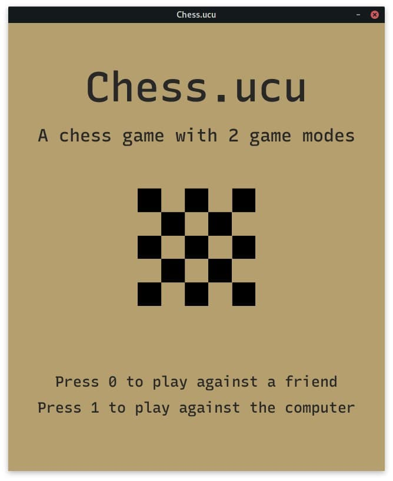

# **Chess.ucu** 


## Description

**Chess.ucu** is a _chess_ project which lets you play against a computer and play with your friend from one computer. This project was made as a semester project by first-year **APPS Students of UCU 2020**. If you want to play the chess yourself, follow the steps below.

## Installation

Clone the repository

```bash
git clone https://github.com/Adeon18/Chess.ucu.git
```

Use the package manager [pip](https://pip.pypa.io/en/stable/) to install the needed libraries.

```bash
pip install requirements.txt
```

## Usage

All you need to do is run the script **main.py** in terminal or via Text Editor and you're good to go.

```bash
python game/main.py
```

You are gonna see a window like this pop up:


**Attention!** If you find the bot too easy or too hard, you can tweak the tree depth, however that may break the program.

## Contributing

- Fork the repository
- Make your change in your forked repository
- Make a pull request and add a rewiever among us(You can see who to add below)

## Credits

- Everything with UI, README. - [Ostap Trush](https://github.com/Adeon18)
- Chess logic - [Olexiy Hoev](https://github.com/alexg-lviv)
- Algoritm that plays the game against you - [Yuriy Nefedov](https://github.com/yuriynefedov)
- Full Wiki organisation and Team work organisation - [Taras Svystun](https://github.com/booyakashakawabangha)
- Helped with wiki - Maxym Seredowich


## License

[MIT](https://choosealicense.com/licenses/mit/)